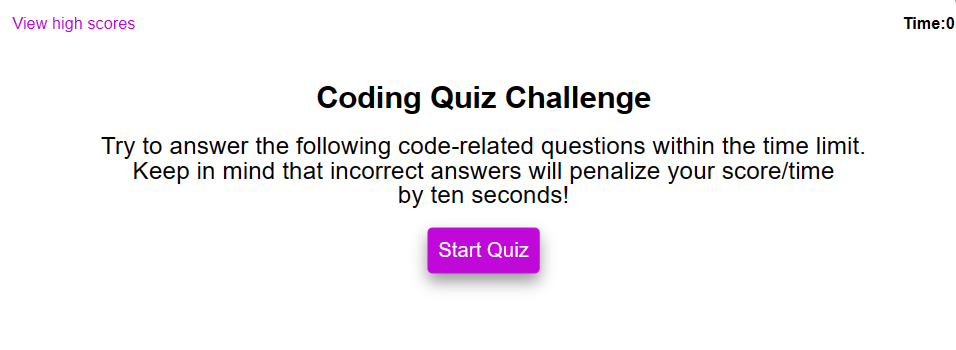
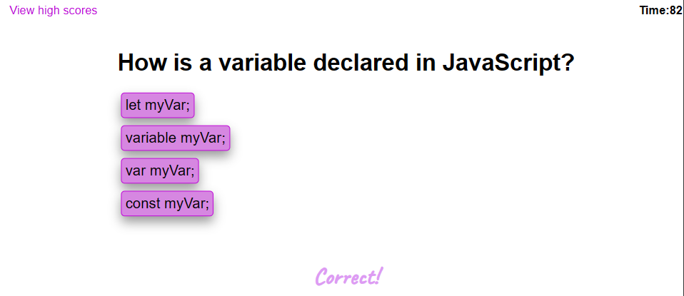
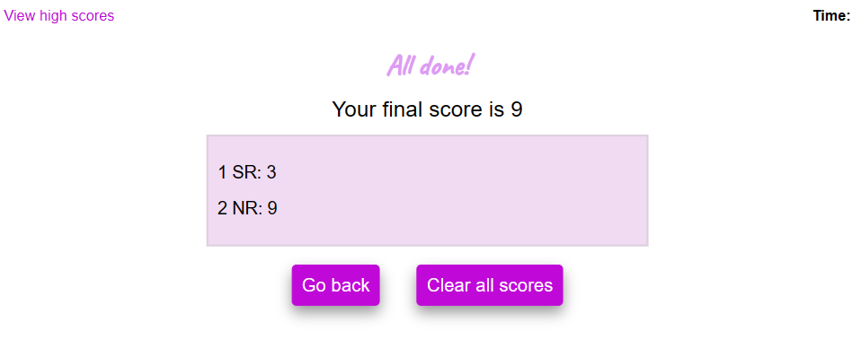
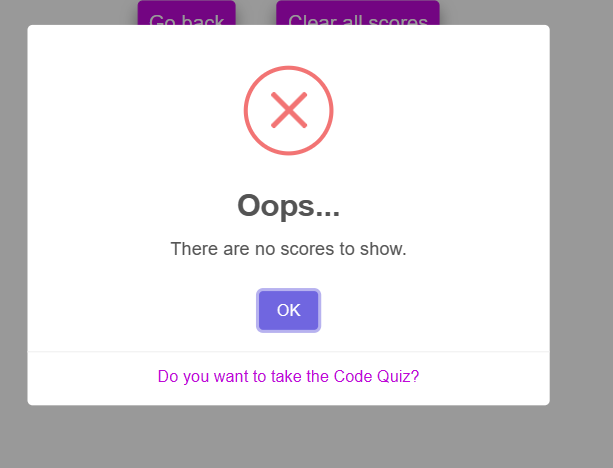
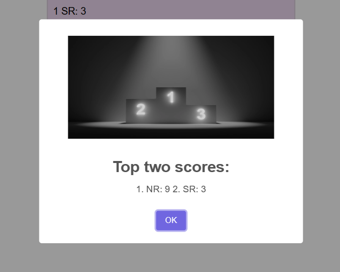

# 👩‍💻code-quiz👨‍💻
This is the Challenge-04 related to Web APIs

## Description

This project is a JavaScript-based coding assessment. Users will face nine multiple-choice questions related to programming, specifically focusing on the JavaScript language. Participants are given a total of 90 seconds to answer all questions. For each incorrect response, 10 seconds will be deducted from the total time. Once all questions are answered, users will submit their initials (first name and last name). They have the option to view the two highest scores and also clear the score history.
SweetAlert library and Google fonts are used in this project.

## Features

1. Timer Display.
2. Feedback on Answers.
3. Score Calculation.
4. User-friendly interface.

## Table of Contents

- [Credits](#credits)
- [License](#license)
- [Website-Appearance](#website)

## Credits

N/A

## License

Please refer to the LICENSE in the repo.

## Website

Link to the live application: 
The following image shows the web application's appearance and functionality:

## Badges

## Thanks for stopping here!.